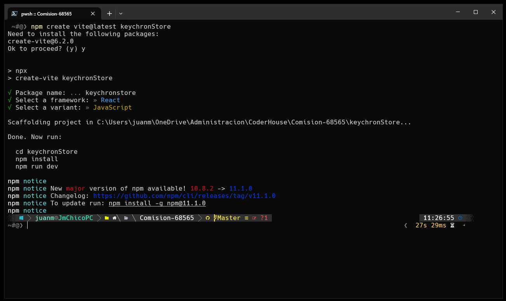
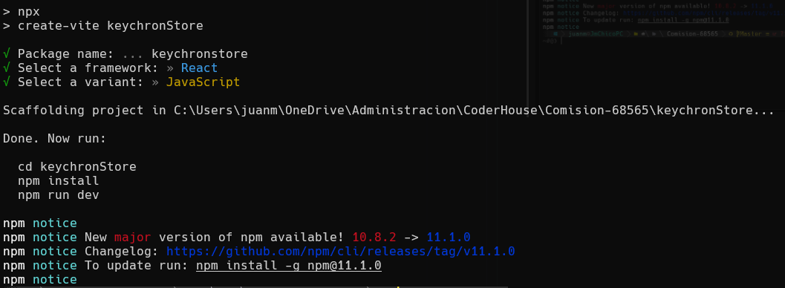
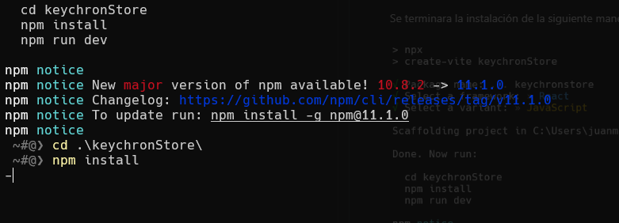
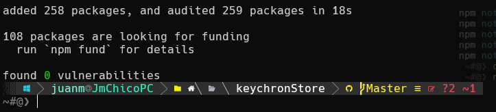
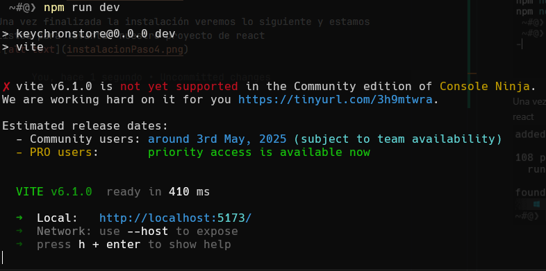

# Documentacion de la Comisión-68565


## Clase de instalación de react

El primer paso es correr el siguiente comando:

`npm create vite@latest NombreDeProyecto`

Ejemplo: `npm create vite@latest keychronStore`
Como se ve en la Imagen siguiente



Una ves completado los pasos donde completaremos las siguientes opciones:

```console
        √ Package name: ... keychronstore
        √ Select a framework: » React
        √ Select a variant: » JavaScript
```
Se terminara la instalación de la siguiente manera




Una vez terminada esta parte, nos movemos a la carpeta creada para el proyecto con el comando

`cd NombreDeMiProyecto`

Ejemplo: `cd .\keychronStore\` y vamos a correr el comando `npm install` y vamos a ver como empieza a instalar todo lo que necesita react para funcionar.



Una vez finalizada la instalación veremos lo siguiente y estamos listos para levantar nuestro proyecto de react



Utilizando el comando `npm run dev`



y veremos que el proyecto ya se encuentra levantado en la dirección indicada en local:  ➜  Local:   http://localhost:5173/


